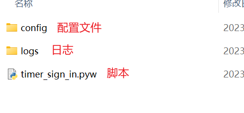

# 环境准备：
```
pip install schedule
pip install selenium
```
> 可能需要其他库文件，自行下载

# python脚本运行相关命令（windows）
## 1.python脚本后台运行
> pythonw：无终端运行，也就是后台运行，也可以将`.py`改为`.pyw`直接双击运行
```
    C:\path>pythonw timer_sign_in.py
```


## 2.查看后台运行python脚本的命令
```
C:\Users> tasklist|findstr "python*"
```

## 3.杀死后台运行脚本
```
pythonw.exe                  19524 Console                    3     36,108 K
python.exe                    5588 Console                    3     30,160 K
python.exe                   37032 Console                    3     21,976 K

C:\Users> taskkill /f /pid 37032
```

# 部署自动启动步骤(windows)
## 1.配置python脚本开机自启动
> 参考链接：https://www.jianshu.com/p/6e5df9ebe25f

### 操作步骤
+ “win+R”
+ 输入“shell:startup”
+ 将python脚本（`timer_sign_in.pyw`）的快捷方式拖入即可
注意：也可以试试`.py`后缀，我没试过，估计就是开个终端窗口运行


# 文件目录说明



# 补充说明
+ 你需要先注册号glados账号
+ 第一次使用时，会弹出对话框，要求您输入glados邮箱验证码;(注意不要在浏览器界面里输入，一定要输入到对话框中)
+ 输入好后确认

### 整个过程都不需要做任何操作，除了填写验证码